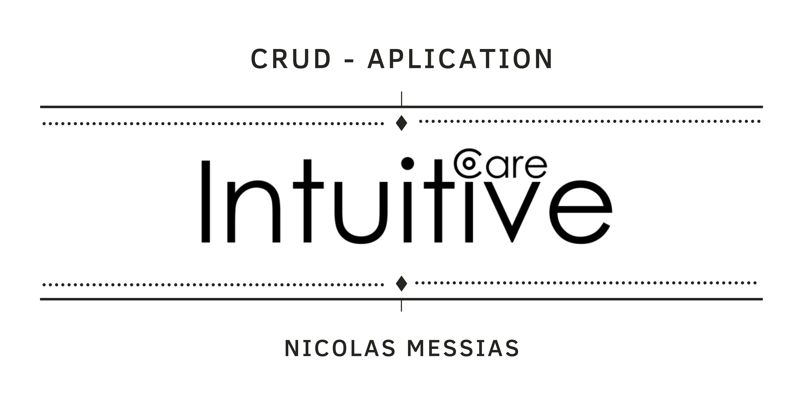
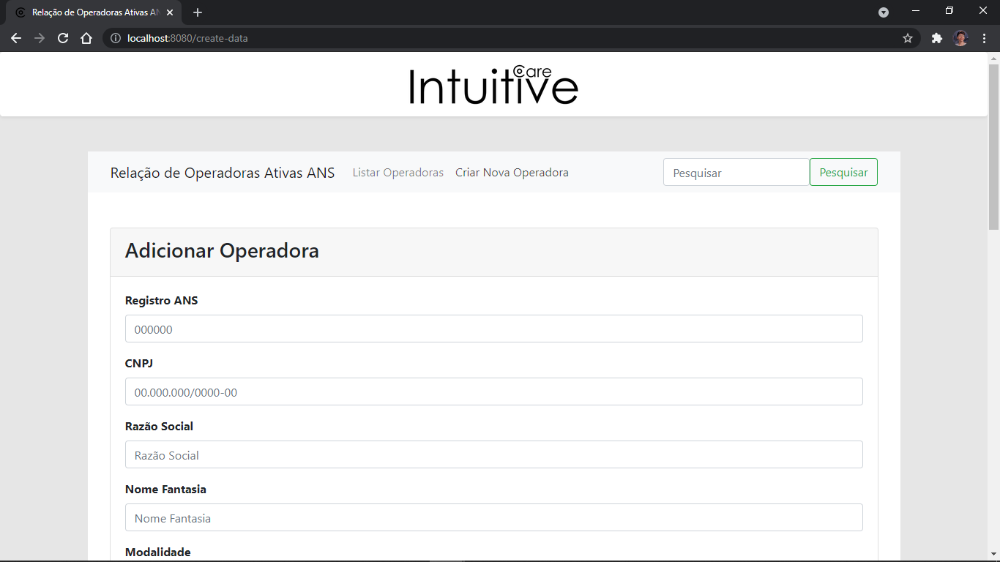
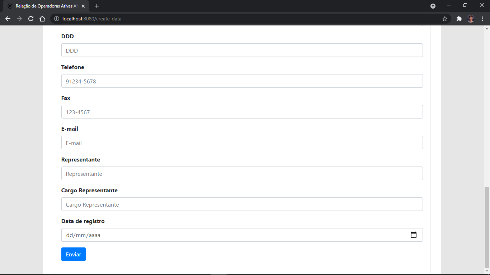
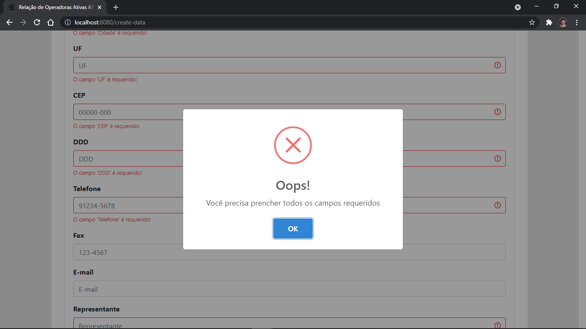
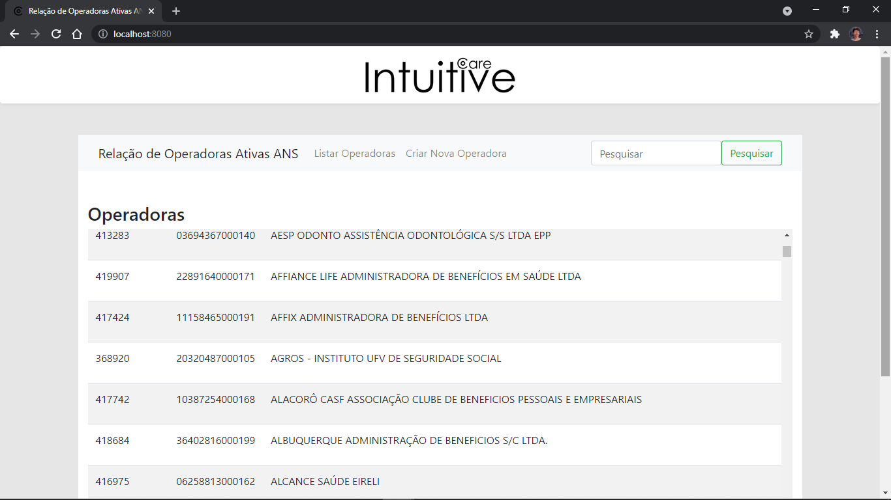
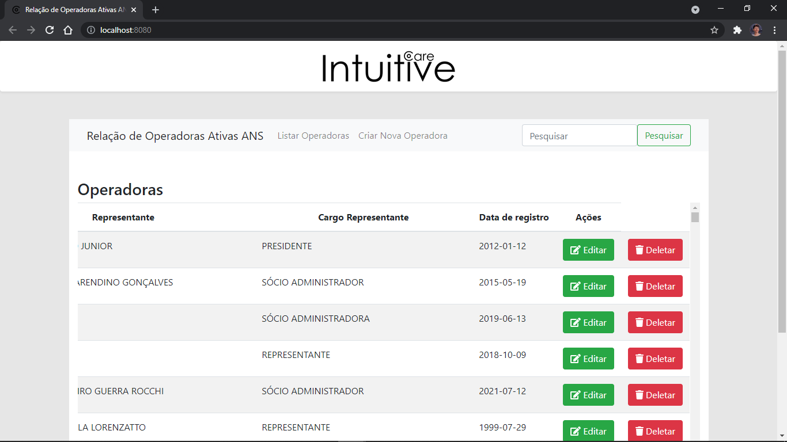
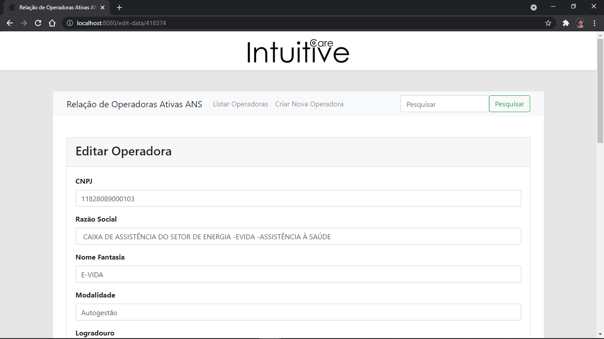
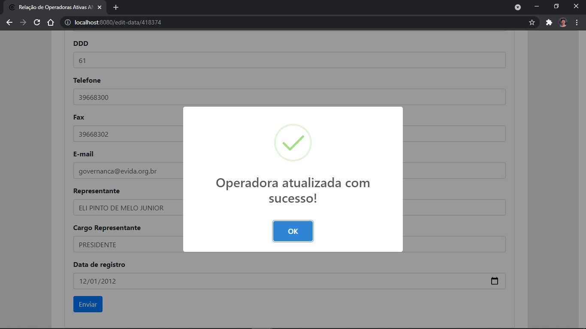
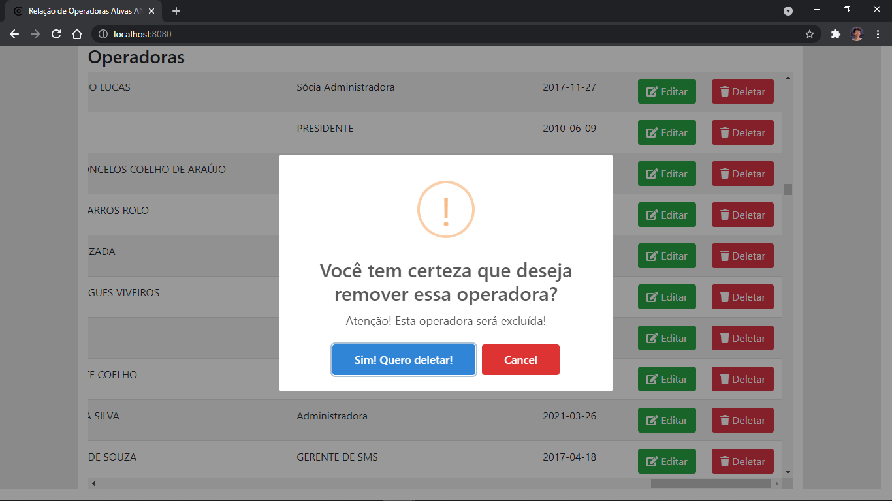
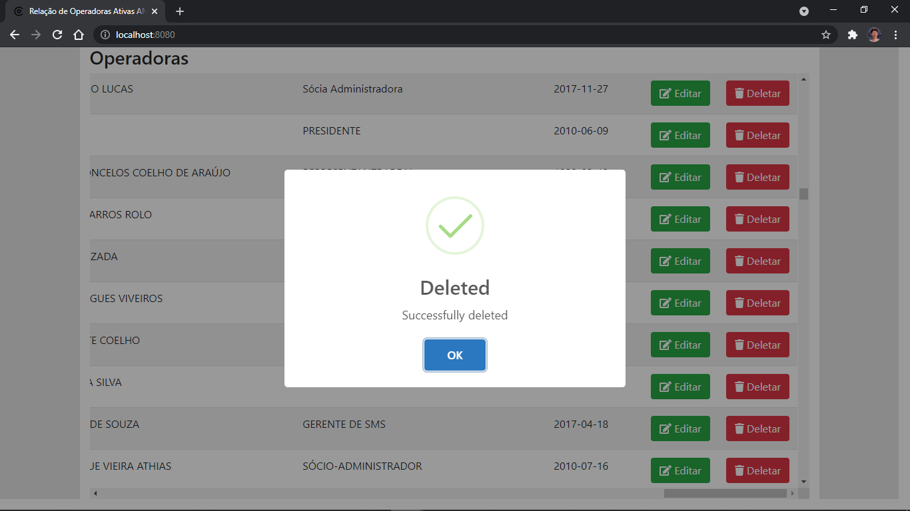

<h1 aling="center">
     
</h1>

## 💻 Sobre

Aplicação CRUD para controle de operadoras ativas da Agência Nacional de Saúde, realizado a fim de teste de nivelamento técnico do processo seletivo para a vaga Front-End Web Developer Intern.

## 🛠 Tecnologias

As seguintes ferramentas foram usadas na construção do projeto:

* **[Visual Studio Code](https://code.visualstudio.com/?WT.mc_id=javascript-9652-gllemos)**
* **[Vue.js](https://vuejs.org/)**
* **[Node.js](https://nodejs.org/en/)**
* **[Postman](https://www.getpostman.com/)**
* **[PostgreSQL - PgAdmin](https://www.postgresql.org/download/)**

E algumas dependências de desing como:

* **[Bootstrap](https://getbootstrap.com.br/)**
* **[Font Awesome](https://fontawesome.com/)**
* **[NProgress](https://www.npmjs.com/package/nprogress)**
* **[SweetAlert2](https://www.npmjs.com/package/vue-sweetalert2)**
* **[Vuelidate](https://vuelidate.js.org/)**

## 🚀 Como executar o projeto

Podemos considerar este projeto como sendo divido em duas partes:
1. Back End (pasta server) 
2. Front End (pasta client)

💡O Front End precisa que o Back End esteja sendo executado para funcionar.

### Pré-requisitos
Antes de começar, você vai precisar ter instalado em sua máquina as seguintes ferramentas:
[Git](https://git-scm.com), [Node.js](https://nodejs.org/en/). 
Além disto é bom ter um editor para trabalhar com o código como [VSCode](https://code.visualstudio.com/?WT.

### 🎲 Rodando o Back End (servidor)

```bash
# Clone este repositório
$ git clone https://github.com/Nicolas-nk/IntuitiveCare-aplication.git

# Acesse a pasta do projeto no terminal/cmd
$ cd relacao_operadoras_ativas_ans

# Vá para a pasta server
$ cd server

# Instale as dependências
$ npm install

# Execute a aplicação em modo de desenvolvimento
$ npm run dev

# O servidor inciará na porta:3000 - o seguinte aviso aparecerá: 
#Aplicação sendo executada na porta: 3000
```
### 🧭 Rodando a aplicação web (Front End)

```bash
# Clone este repositório
$ git clone https://github.com/tgmarinho/nlw1

# Acesse a pasta do projeto no seu terminal/cmd
$ cd relacao_operadoras_ativas_ans

# Vá para a pasta da aplicação Front End
$ cd client

# Instale as dependências
$ npm install

# Execute a aplicação em modo de desenvolvimento
$ npm run start

# O servidor inciará na porta:8080 - o seguinte aviso aparecerá: 
#App running at:
#  - Local:   http://localhost:8080/0/                               8:8080/
#  - Network: http://192.168.15.148:8080/    
```
## 🧩 Funcionalidades e layout

* C - Create (criar)
* R - Read (ler)
* U - Update (Atualizar)
* D - Delete (Deletar)

### Create

<p align="center" style="display: flex; align-items: flex-start; justify-content: center;">
  

  

  
</p>

### Read - pagina inicial

<p align="center" style="display: flex; align-items: flex-start; justify-content: center;">
  

  
</p>

### Update

<p align="center" style="display: flex; align-items: flex-start; justify-content: center;">
  

  
</p>

### Delete

<p align="center" style="display: flex; align-items: flex-start; justify-content: center;">
  

  

  
</p>

## ⏱  Atualizações por vim

* Concertar bug de atualização de dados
* Implementação de pesquisa textual


## 📝 Ass

Feito com ❤️ por Nicolas Messias 👋🏽 [Entre em contato!](linkedin.com/in/nicolas-messias)
